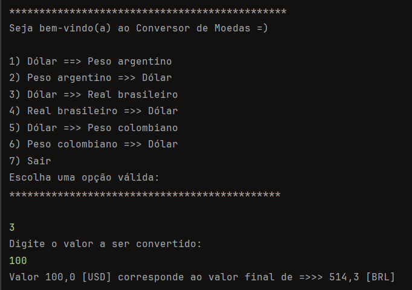
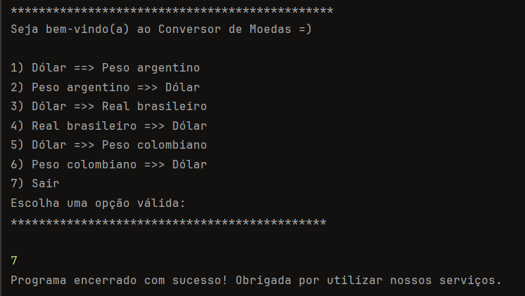

<h1 align="center"> Conversor de Moedas </h1>

Desenvolvido por:
 Mislene Moura - [Linkedin](https://www.linkedin.com/in/mislene-silva-moura-1211531b4//) |
[Github](https://github.com/MisleneSM)

## Índice

* [1. Resumo do projeto](#1-resumo-do-projeto)
* [2. Objetivos de aprendizagem](#2-objetivos-de-aprendizagem)
* [3. Resultado do Projeto](#3-resultado-do-projeto)
* [4. Tecnologias Utilizadas](#4-tecnologias-utilizadas)

***

## 1. Resumo do Projeto🤩

Desenvolvido um Conversor de Moedas tendo como principal objetivo trabalhar com ferramentas do Java e aprendendo a fazer requisições a uma API de taxas de câmbio. Além disso manipular dados JSON, filtrar e exibir as moedas de interesse.

OBJETIVO DO PROJETO: Desenvolver um Conversor de Moedas que ofereça interação textual (via console) com os usuários, proporcionando no mínimo 6 opções distintas de conversões de moedas em um menu. A taxa de conversão não será estática, mas sim dinamicamente obtida por meio de uma API, garantindo dados precisos e em tempo real para uma experiência mais atualizada e eficaz.

Passos completados:

* Configuração do Ambiente Java;
* Criação do Projeto;
* Consumo da API;
* Análise da Resposta JSON;
* Filtro de Moedas;
* Exibição de Resultados aos Usuários;

Para acessar o resultado do projeto, basta realizar o fork ou download deste projeto e se aventurar pelo seu console.

## 2. Objetivos de aprendizagem✅

- Java
- Programação Orientada a Objetos
- API
- Gson
- Json

## 3. Resultado do Projeto📝

###### Resultado Final

## 4. Tecnologias Utilizadas✅

    
    
    

